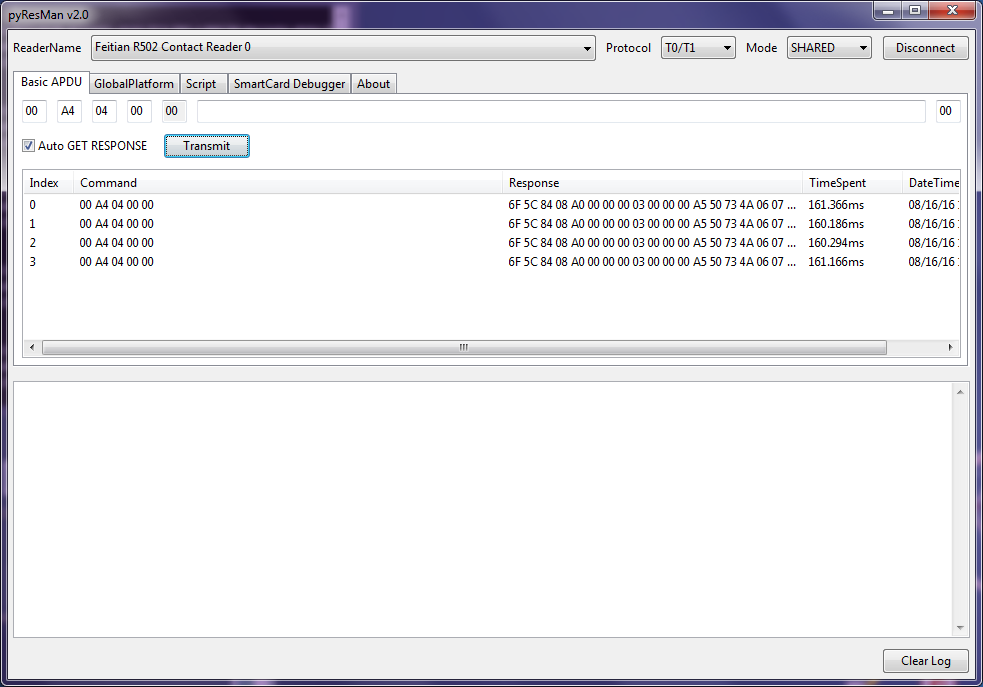
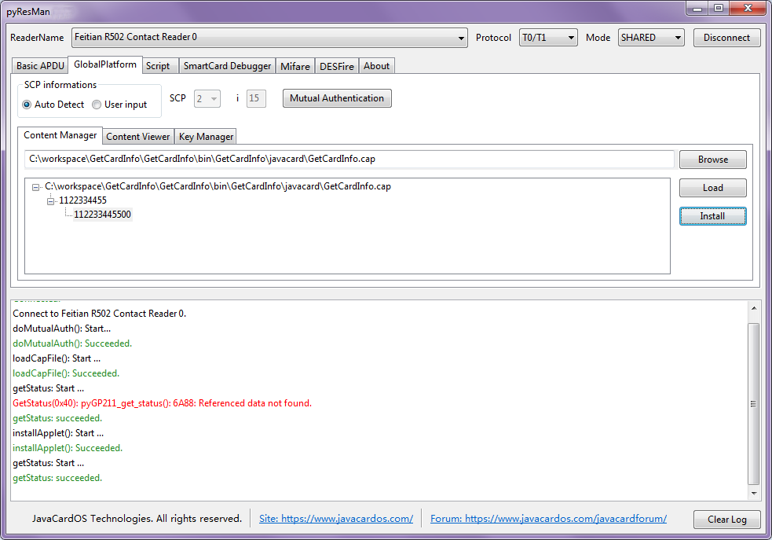
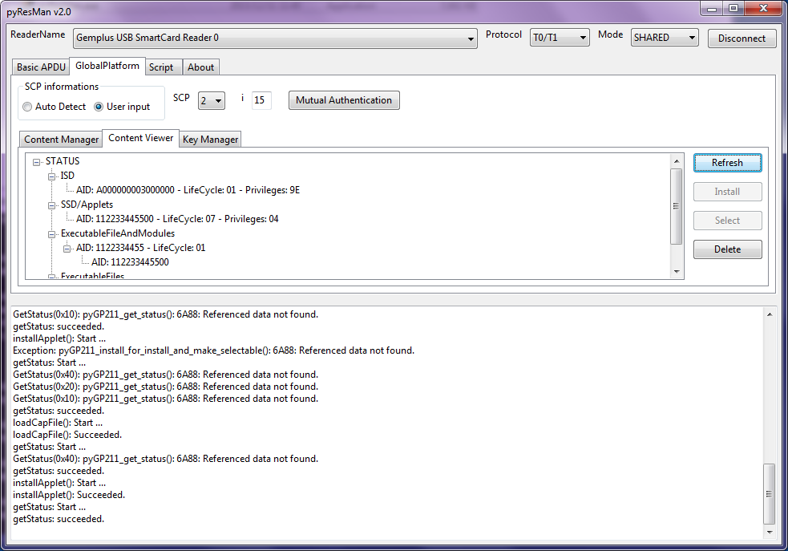
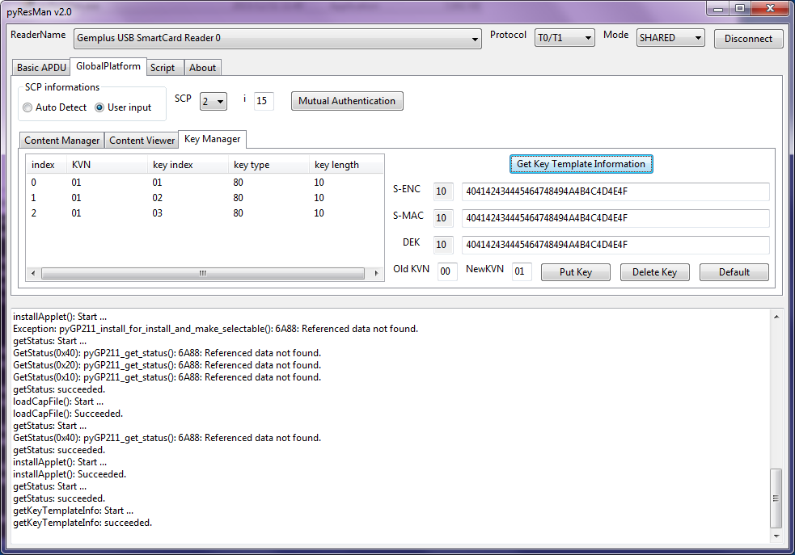
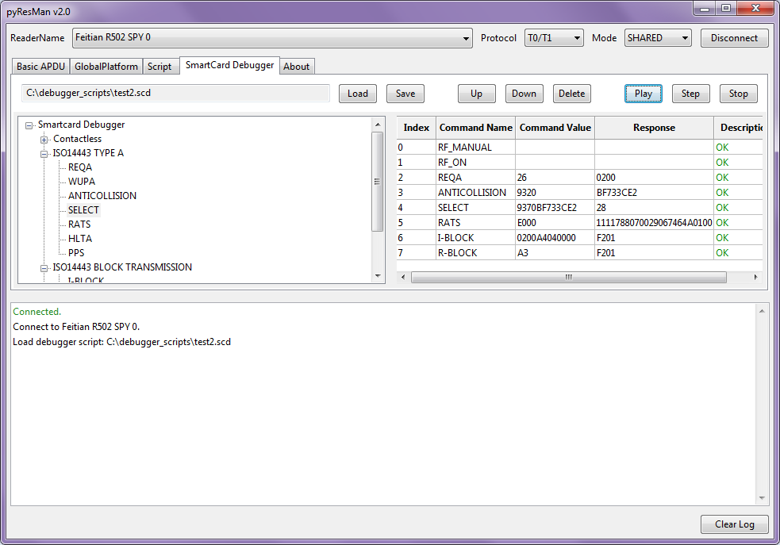
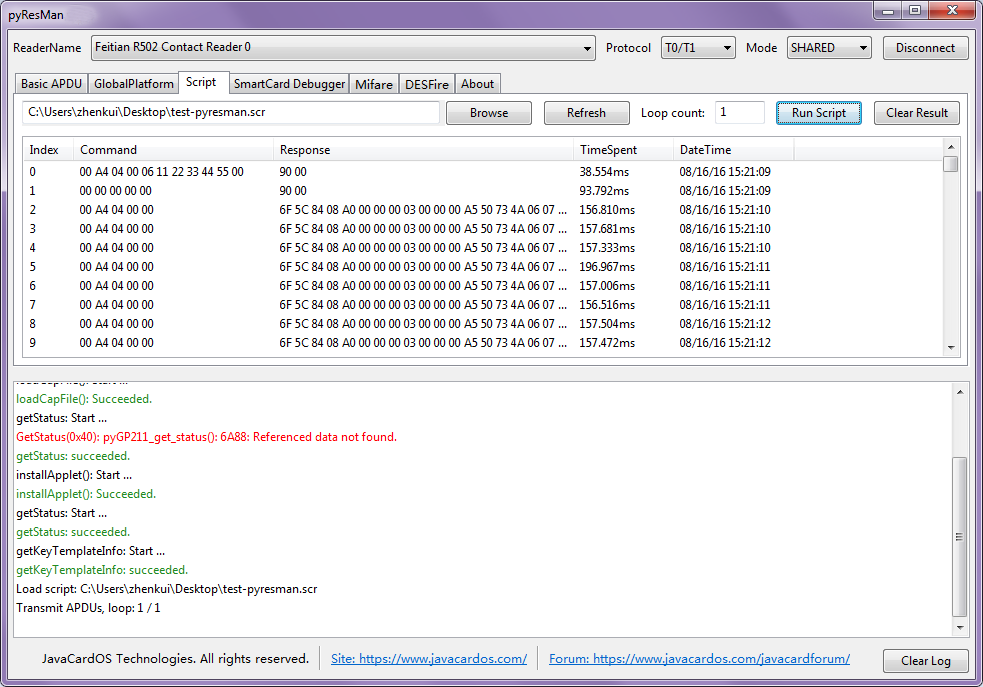
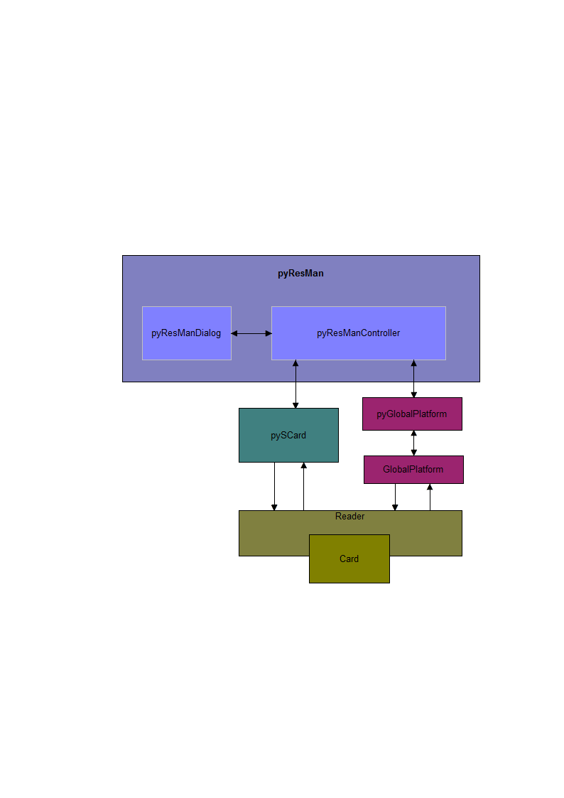

# pyResMan
A open source **smartcard** **APDU tool** to manage smartcard resource. It can be used to debug **ISO14443** protocol commands and **Mifare** commands with R502 SPY reader. It is based on **pyResMan** project and py**GlobalPlatform** project.

##Dependencies

* [Python](https://www.python.org/)
* [pyScard] (http://pyscard.sourceforge.net/)
* [pyGlobalPlatform] (https://github.com/JavaCardOS/pyGlobalPlatform)
* [GlobalPlatform] (http://sourceforge.net/projects/globalplatform/)
* Compiler: [pyInstaller](http://www.pyinstaller.org/)

##User Manual
Please visit: [pyResMan User Manual](http://javacardos.com/tools/pyresman.html)

##Discussions
Please visit: [pyResMan Discussions](http://javacardos.com/javacardforum/viewforum.php?f=39)

##User Interface

###Basic APDU

###GlobalPlatform: Content Manager

###GlobalPlatform: Content Viewer

###GlobalPlatform: Key Manager

###SmartCard Debugger

###Script

##Module Figure

##TODO
* APDU Script editable;
* GP compatible;
* SW look up;
* Display and parse ATR;
