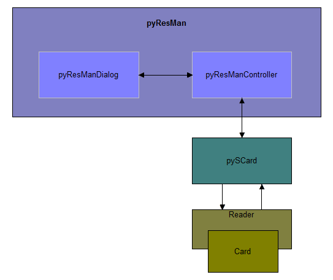

# pyResMan
A tool to manage smartcard resource.

**Dependencies**

* [Python](https://www.python.org/)
* [pyScard] (http://pyscard.sourceforge.net/)
* Compiler: [pyInstaller](http://www.pyinstaller.org/)

**Compile**

```
pyinstaller -F -npyResMan --version-file version.txt -w Main.py
```
**User Interface**


**Module Figure**



**Operations**

* **Connect card**: Select reader, transmit protocol, connect mode and connect
* **Transmit sing APDU command**: Input CLA, INS, P1, P2, LC, DATA, LE, then tranmit it to the card
* **Auto GetResponse**: If transmit protocol is T0, check the "Auto GetResponse" flag to auto get response
* **Run APDU script**: Select script file, set run loop count, and run the script
* **Run select APDU item**: Select single/multi item(s) in the APDU list view, and use the popup menu to run it/them
* **Visit website**: Click the website url to visit our website
* **Join discussion**: If have any problems, click the Discussion url to visit our forum to join discussion

**TODO**
* Script editable
* GP commands supports
