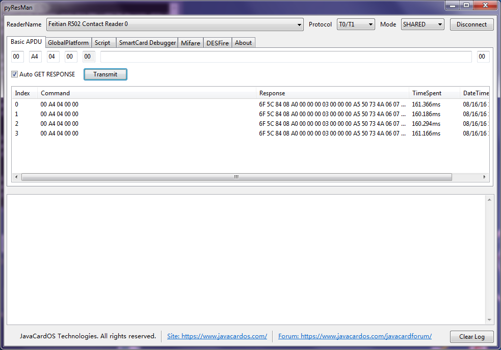
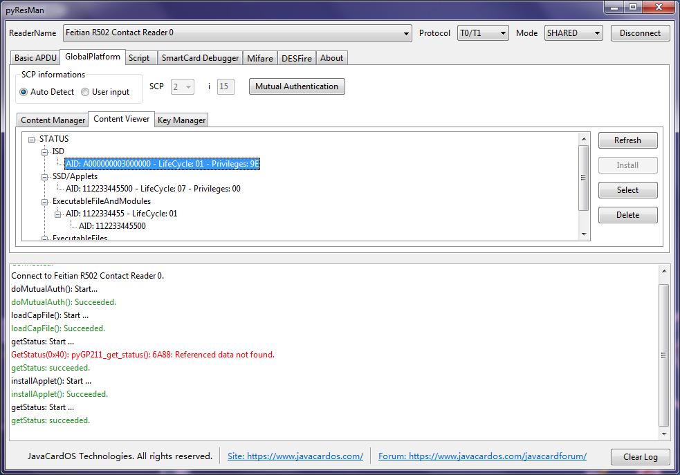
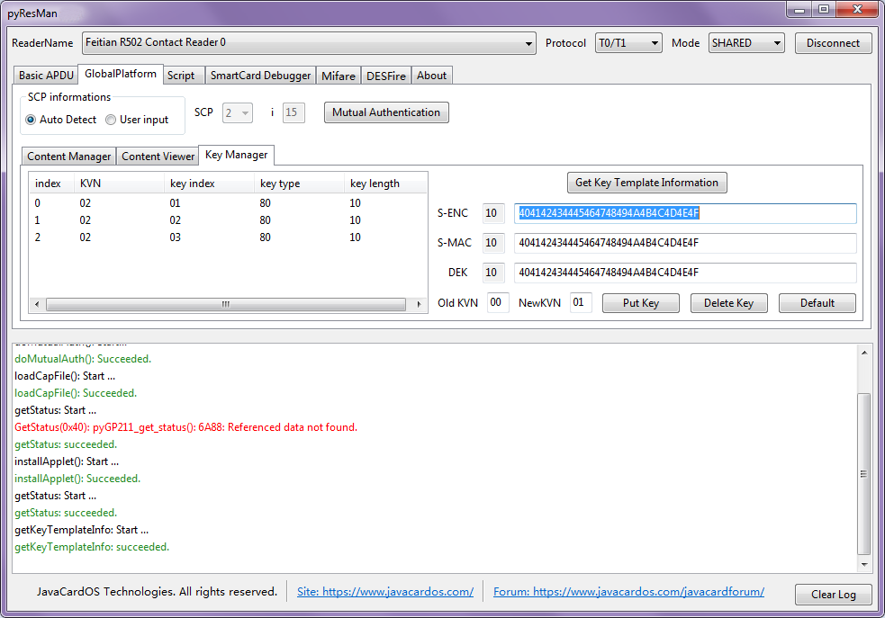

# pyResMan
A open source **smartcard** tool to manage smartcard resource. It is based on **pyResMan** project and py**GlobalPlatform** project.

##Dependencies

* [Python](https://www.python.org/)
* [pyScard] (http://pyscard.sourceforge.net/)
* [pyGlobalPlatform] (https://github.com/JavaCardOS/pyGlobalPlatform)
* [GlobalPlatform] (http://sourceforge.net/projects/globalplatform/)
* Compiler: [pyInstaller](http://www.pyinstaller.org/)

##Compile

```
pyinstaller -F -npyResMan --version-file version.txt -w pyResMan/Main.py
```

##Run as python program

```
python pyResMan/Main.py
```


##User Interface

###Basic APDU

###GlobalPlatform: Content Manager

###GlobalPlatform: Content Viewer

###GlobalPlatform: Key Manager

###Script


##Module Figure


##Operations

* **Send APDU**:
	* Go to "Basic APDU" frame;
	* Input CLA, INS, P1, P2, LC, DATA and Le, press "Transmit" button to **send APDU command**;
	* The command and response data display in the followed list ctrl.
* **Load CAP file**
	* **Notice:** Click "Mutual Authentication" button to establish secure channel first.
	* Go to "GlobalPlatform" frame;
	* The "Content Manager" sub frame;
	* Click "Browse" button to select the CAP file;
	* After the CAP file selected, CAP file information (Package and Applet information) will display in the followed tree ctrl;
	* Press "Load" button to **load the CAP file** to card;
	* Select one applet displayed in the tree ctrl, click "Install" to **install applet**.
* **View card content**
	* **Notice:** Click "Mutual Authentication" button to establish secure channel first.
	* Go to "GlobalPlatform" frame;
	* The "Content Viewer" sub frame;
	* Click "Refresh" button to **list card content**;
	* You can select one applet and click "Install" button to **install applet**;
	* You can select one applet instance and click "Select" button to **select applet**;
	* You can select one applet instance/package and click "Delete" button to **delete applet/package**.
* **Key Manage**
	* **Notice:** Click "Mutual Authentication" button to establish secure channel first.
	* Click "Get Key Template Information" button to **get key template informations**;
	* **Add new key**:
		* Input value bytes of S-ENC/S-MAC/DEK key;
		* Input Old KVN as "00" and input the New KVN;
		* Click "Put Key" button to add new key.
	* **Replace exists key**:
		* Input value bytes of S-ENC/S-MAC/DEK key;
		* Input Old KVN and New KVN;
		* Click "Put Key" button to replace the key.
	* **Delete key**:
		* Select the key you want to delete in the "Key Template Information" tree ctrl;
		* Click "Delete Key" button to delete the selected key;
	* **Set key bytes to default value**:
		* Click "Default" button.
* **APDU script**
	* Go to "Script" frame;
	* Click "Browse" to select the APDU script file;
	* After the APDU script file selected, APDU commands in the script file will be listed in the list ctrl;
	* Click "Run Script" button to run the APDU script;
	* APDU command and response data displayed in the list ctrl.

##TODO
* APDU Script editable;
* GP compatible;
* SW look up;
* Display and parse ATR;