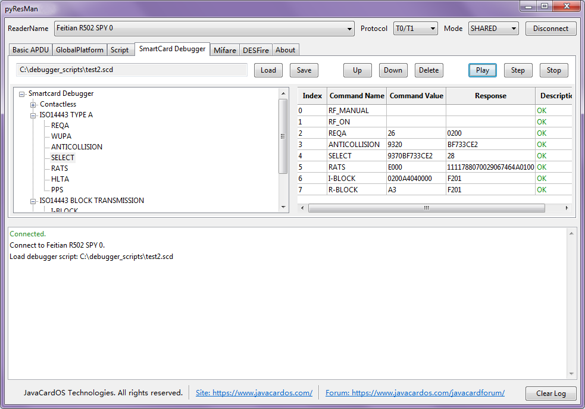
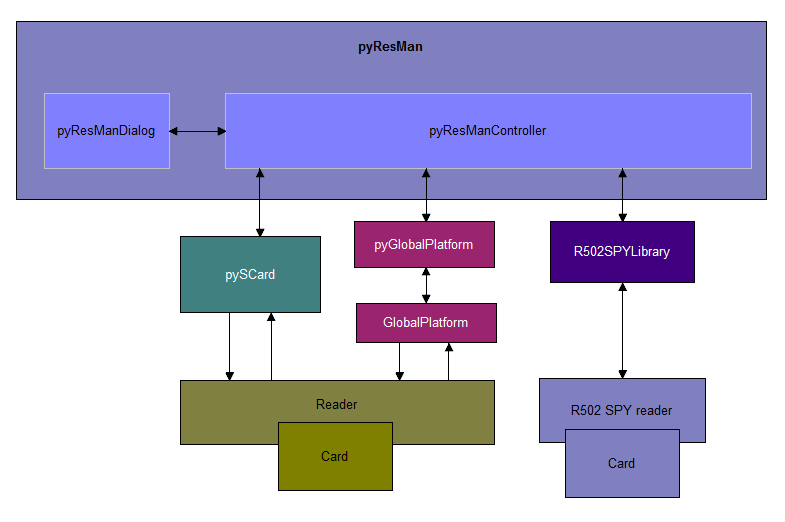

# pyResMan
A open source **smartcard** **APDU tool** to manage smartcard resource. It can be used to debug **ISO14443** protocol commands and **Mifare** commands with R502 SPY reader. It is based on **pyResMan** project and py**GlobalPlatform** project.

## Dependencies

* [Python](https://www.python.org/)
* [pyScard] (http://pyscard.sourceforge.net/)
* [pyGlobalPlatform] (https://github.com/JavaCardOS/pyGlobalPlatform)
* [GlobalPlatform] (http://sourceforge.net/projects/globalplatform/)
* Compiler: [pyInstaller](http://www.pyinstaller.org/)

## User Manual
* [pyResMan User Manual](http://javacardos.com/tools/pyresman.html?ws=github&prj=pyResMan)
* [R502 SPY debug User Manual](http://javacardos.com/wiki/index.php/home/article/detail/category/r502spy-usermanual.html?ws=github&prj=pyResMan)

## Discussions
Please visit: [pyResMan Discussions](http://javacardos.com/javacardforum/viewforum.php?f=39?ws=github&prj=pyResMan)

## User Interface

### Basic APDU

### GlobalPlatform: Content Manager

### GlobalPlatform: Content Viewer

### GlobalPlatform: Key Manager

### SmartCard Debugger

### Script

## Module Figure

## TODO
* APDU Script editable;
* GP compatible;
* SW look up;
* Display and parse ATR;
